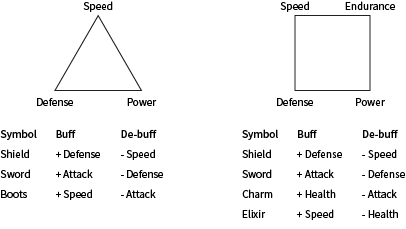

# Equipment

[The AoW Ideas project](https://github.com/nefarious-kitsune/aow.ideas):
*Ideas from AoW players on changes & improvements to help make the game more interesting.*

[中文版](zh.equipment)

## Problem

The game has to evolve to keep high-roller players interested.
After the introduction of level 17 heroes and level 10 troops,
it is only a matter of time before the next *big upgrade*:

- level 20 hero and/or level 11 troops
- new troops that make some of current meta troops obsolete
- new heroes that make some of current meta heroes obsolete

Every time this happens, some veteran players that developer wish to
keep become disheartened and leave. We need an alternative approach to
introduce varieties without alienating veteran players.

Goals:

* To allow for personalized military style
* To maintain game balance

## Suggested Solution

* New game item, **equipment**, for allowing players to *personalize* their army.
* The equipments will both *buff* and *de-buff* player's army, so it's not a simple upgrade
* The new items would allow end-game players to emphasize certain aspect of
their army (speed, power, or tank) while also allowing developing players to
stay their own path without losing competitiveness.

**Possible systems**

### System 1

* A simple system
* The equipment affect the defense, power, and speed
   - **The Shield of Altas**: Equip the army with heavy, protective gear that slows down the army
   - **The Blade of Heracles**: Equip the army with powerful weapon but also reduces armor
   - **The Boots of Odysseus**: Equip the army with ultra light-weight armor for more mobility

| Armor       | Buff     | De-buff    |
| ----------- | -------- | ---------- |
| Atlas       | +Defense | -Speed     |
| Heracles    | +Attack  | -Defense   |
| Odysseus    | +Speed   | -Attack    |
| Regular     | no buff  | no de-buff |

### System 2

* A more complex system that may inadvertently upset game balance
* The equipment affect the endurance, defense, power, speed, and endurance
   - **Shield**: Equip the army with heavy, protective gear that slows down the army
   - **Sword**: Equip the army with powerful weapon but also reduces armor
   - **Charm**: Equip the army with blessing charm that increase health but reduces attack
   - **Elixir**: Equip the army with magic potion that increases speed but reduces health

| Equipment   | Buff     | De-buff    |
| ----------- | -------- | ---------- |
| Shield      | +Defense | -Speed     |
| Sword       | +Attack  | -Defense   |
| Charm       | +Health  | -Attack    |
| Elixir      | +Speed   | -Health    |
| Regular     | no buff  | no de-buff |

### Implementation and Game Play

- Change the "Heroes" page to "Academy" page for accessing heroes, troops, and equipments
- Equipment come in cards. Merge two level 1 armor creates a level 2 armor
- A level-2 equipment has higher buff/de-buff than a level-1 equipment. For example:

| Equipment             | Buff        | De-buff    |
| --------------------- | ----------- | ---------- |
| Lvl 1 Shield of Atlas | +2% defense | -5% Speed  |
| Lvl 2 Shield of Atlas | +3% defense | -7% Speed  |

- The player may need to keep different levels of equipment and find an appropriate level that fit their own style
- On the battle screen, a equipment icon appears each player's icon.
- Tap the icon to reveal the equipment's stats.
- The equipment's ability is passive and apply to all of player's own units
- The equipment's ability has no affect on opponent's army
