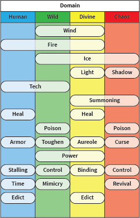

# Domains and Elements

[The AoW Ideas project](https://github.com/nefarious-kitsune/aow.ideas):
*Ideas from AoW players on changes & improvements to help make the game more interesting.*

## Domains

Change unit grouping from *Races* to *Domains*. "Domain" is a more generic umbrella concept than "Race" and provides better grouping logics.

For example, Ballista and Goblin Cannons are inanimate objects constructed by humans and wild beings, and are more aptly described as units of Human Domain and Wild Domain.

Change "Dark Race" to "Chaos Domain". There are Supernatural units that are neither from the natural world or the underworld. For example, Meteor Golem should be better described as alien beings belonging to the Chaos Domain.

Change "Racial Synergy" and "Racial Restraint" to "Domain Synergy" and "Domain Restraint".

## Skill Elements

Reclassify attack and defense skills as Skill Elements that occupy specific Domains.

## Air, Fire, and Ice

**Air** can either enhance fire or suppress fire; because of this controlling ability, Air dominates Fire. Note, however, Air has no effect on *Light*, which can sometimes be mistaken as Fire.

**Fire** can melt Ice; therefore, Fire dominates Ice.

**Ice** affects temperature, which regulates air flow; therefore, Ice dominates Air.

Because Fire produces light, the Chaos Domain CANNOT control Fire. 

|          | Air       | Fire      | Ice     |
| ---------| --------- | ----------| --------|
| Human    | n/a       | Davison   | n/a     |
| Wild     | Frejya    | Aly       | Kraken  |
| Divine   | Nezha     | Nezha     | Chione  |
| Chaos    | n/a       | n/a       | Kelvins |

**Counter Relationships**
* Wind > Fire > Ice
* Fire > Shadow

**Suggested change**
- Heroes that controls Air should have the ability to increase physical range attacks. Therefore, Freyja's passive skill should allow for additional damage from *physical* range attacks.
- Heroes that controls Air should have the ability to suppress fire attacks. Therefore, Freyja's legendary skill should be changed to damage reduction from Fire attacks (both basic and skill).

-----

## Light and Shadow

**Light** (including __Lightening__) is an element that is __exclusively__ controlled by the Divine domain.

**Shadow** is an element controlled by the Chaos domain.

|          | Light     | Shadow    |
| ---------| --------- | ----------|
| Human    | n/a       | n/a       |
| Wild     | n/a       | n/a       |
| Divine   | Apollo    | n/a       |
| Chaos    | n/a       | Mephisto  |

**Counter Relationships**
* Light > Shadow

**Suggested change**
- Change the Spider Queen description. She lives in the shadow, so she is from the Chaos domain and should be vulnerable to both Light and Fire attack.
- Change the special effect of **Priest Mage** from red flame to golden energy blast. Since Light counters Shadow (Spider Queen), this will not affect Spider Queen campaigns.

-----

## Tech

**Tech** is an element that is controlled by the Human and Wild domain. Examples: Planck, Ballista, Goblin Cannon.

**Suggested change**
- Introduce __Bomb Machine__ which produces walking bombs that produces small explosion upon contact with enemy troops.

-----

# Time Travel, Summoning, Revival

**Time Travel** is an element that can be manipulated by the Human domain.

**Summoning** is an element that is controlled by the Divine and Chaos domains. Examples: Dracula (bats), Athena (spears).

**Revival** is an element that can be controlled by the Chaos domain.

Note that these are distinctive concepts, and rules regarding troops revival need to be rewritten (see Edict below)

**Suggested change**
- Introduce a new Sacred hero that can summon troops to the field. For example, when a Human troops died honorably in the battle field (dealt XXX damage from __basic attack__ before death), **Odin** would ordain the troops into __Valhalla__, and Odin would periodically summon the troops back into the field.

-----

# Edict

Kings in the Human and Divine domains can impose restrictions (**Edicts**) on the battle field.

For example, Horus can impose an edict that prohibits certain natural rules to be changed (e.g. Time Traveling and Revival).

For example, Jinn can grant the Last Wish.

**Suggested change**
- Change Horus's skill description so that he prohibits Time Traveling and Troops Summoning by non-Sacred units. The new skill would allow Horus to prohibit the summoning of reflection (Ainz), bats (Dracula), demons (Mephisto), skeletons, and small spiders (Spider Queen), but the Edict would not affect Jinn's Last Wish and Odin's calling troops from __Valhalla__).
- Change the skills of Ivan and Beowulf so they can impose some kind of rules.

-----

# Armor, Toughen, Aureole, and Curse

The Human domain can use technology and innovation to provide **armor** to the troops. The **Armor** can have special property such as *Energy Absorption and Blast* and *Damage Reflection*.

**Toughen** is an element that is controlled by the Wild domain. Examples: Kraken.

**Aureole** is protection via God's blessing and is is controlled by the Divine domain.

**Curse** is an element that is controlled by the Chaos domain. Examples: Voodoo Dolls.

**Counter Relationships**
* Armor > Toughen > Aureole > Curse

Note: Aureole does not counter Armor

**Suggested change**
- Change Selene's skill so that her passive skill allows troops to be immune to all curses (Voodoo Dolls, Dark Witch) and all control effect from the *Chaos* domain (e.g. ignore stun from Yasha and Meteor Golem, but affected by Aly's stun effect). Reduce Selene's damage immunity to balance the game.
- Change Cactuses skill so that they have fixed physical counter attack instead of Reflection

-----

# Power

**Power** (energy) is an element that is controlled by the Wild and Divine domains. Examples: Aly, Athena.

This is a catch-all element for some non-elemental attacks, such as Taurus Witchers' energy blasts.

-----

# Stalling, Control, and Binding

**Stalling** is an element that is controlled by the Wild and Chaos domains.

**Binding**

**Control** is an element that is controlled by the Wild and Chaos domains.

**Counter Relationships**
* Wild Control ignores control immunity of the Divine domain.
* Chaos Control ignores control immunity of the Human domain.

-----

# Poison

**Poison** is an element that is controlled by the Wild and Chaos domains.

Poison has the special property that it deals *internal* damage that ignore certain immunity.

**Counter Relationships**
* Wild Poison ignores damage immunity of the Divine domain (e.g. ignores Selene's passive skill)
* Chaos Poison ignores damage immunity of the Human domain (e.g. ignores Arthur's passive skill).

**Suggested Changes**

* **Snake Queen** (wild) or Medusa (dark): an __Assassin__ hero who wears pouches of poisonous needles on the waist. She releases the needles onto the enemy and deal both physical and internal damage. The physical damage can be reduced by Armor (Human) and Toughen (Wild) but not Aureole (Divine).
* **Cactuses** - Remove reflection ability. When cactuses receive physical melee attacks, the thorns on the Cactuses deal counter-damage and inject venoms into the attacker's body.
* **Jellyfish** (wild) - Passive troops that uses bioluminescence to attract enemy troops and release venoms when attacked. 
* **Poison Moth** (wild) - Back-attacking units that release poisonous spores while flying to the back of the enemy lines.
* **Shadow Raiders** (dark, 9-load range units) - Fast-moving troops that shoot poisonous darts from dart blowers

-----

# Mimicry

**Mimicry** is an element that is controlled by the Wild domains.

**Suggested Changes**

* **Slim** - When attacked by a troops, the slim turns into a copy of that troops. Cannot be cursed by Voodoo Dolls.
