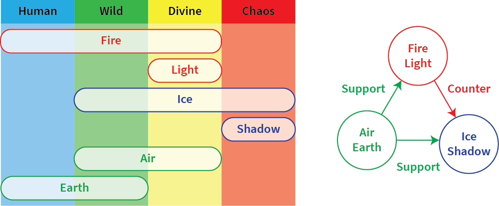

[The AoW Ideas project](https://github.com/nefarious-kitsune/aow.ideas):
*Ideas from AoW players on changes & improvements to help make the game more interesting.*

# Natural Elements

Natural Elements are to be grouped into 3 *pairs* of sub-elements:

<table style="border-collapse: collapse; border: 1px solid">
  <thead>
    <tr>
      <th>Main Type</th>
      <th>Concept</th>
      <th>Sub-Type</th>
      <th>Properties</th>
    </tr>
  </thead>
  <tbody>
    <tr>
      <td rowspan=6>Natural Elements</td>
      <td rowspan=2>Power</td>
      <td>Fire</td>
      <td>Very powerful. Resistance to Freezing.</td>
    </tr>
    <tr>
      <td>Light</td>
      <td>Somewhat powerful. Resistance to Control.</td>
    </tr>
    <tr>
      <td rowspan=2>Darkness</td>
      <td>Ice</td>
      <td>Binding (Freezing)</td>
    </tr>
    <tr>
      <td>Shadow</td>
      <td>Control (Fear/Taunt)</td>
    </tr>
    <tr>
      <td rowspan=2>Support</td>
      <td>Air</td>
      <td>Enhancement</td>
    </tr>
    <tr>
      <td>Earth</td>
      <td>Reduction</td>
    </tr>
  </tbody>
</table>

----

## Fire and Light

The two elements are generally associated with power and energy.

**Fire** is the *most* powerful of all elements. Troops with the Fire element has additional **Freezing Resistance** (16 instead of 12) (Note: heroes are not affected). Because Fire produces light, the Chaos Domain cannot control Fire. 

**Light** (including lightening and electricity) is fairly powerful and exclusively controlled by the Divine Domain. Troops with the Light element has additional **Control Resistance**. 

----

## Ice and Shadow

The two elements are generally associated with darkness and chaos.

**Ice** creates the effect of Binding (Freezing).

**Shadow** creates the effect of Disruptive Control (Physical and Psychic)

-----

## Air, Earth, and Water

These elements are *support* elements for the other Natural Elements.

**Air** can *enhance* other elements
- Air can increase attack and/or movement speed of friendly units
- Air can increase damage output of friendly units

**Water** is similar to Air except it is exclusive to Poseidon only

**Earth** can *reduce* other elements
- Earth can reduce attack and/or movement speed of enemy units
- Earth can reduce damage taken by friendly units

-----

## Examples

**Poseidon** (Water/Magic)
- Uses the Water Element to increase the speed of friendly units
- *Enhance* the output of Fire, Light, and Magic
- Can be *countered* by Earth, Ice, and Tech

**Frejya** (Air/Physical)
- Uses the Air Element to increase the speed of friendly units
- **Uses the Air Element to increase the damage output of ranged units**
- Can be *countered* by Earth, Ice, and Tech

**Aly** (Fire/Magic)
- Use the Fire Element to deal massive magical damage
- Have additional Freezing Resistance
- Can be *enhanced* by Air
- Can be *countered* by Earth, Tech, Control

**Selene** (Light/Magic)
- Use the Light Element to enhance damage output of friendly units
- **Use the Light Element to provide *Control Resistance* to friendly units** (at start of battle, friendly units are immune to all Disruptive Controls, such as Stun, Taunt, and Fear).
- Can be *enhanced* by Air and Fire
- Can be *countered* by Earth, Ice, and Tech

**Fire Archers** (Fire/Physical)
- Use the Fire Element to deal massive damage
- Have additional Freezing Resistance
- Can be *enhanced* by Air
- Can be *countered* by Earth and Tech (Reflection)

**Spider Queen**
- Vulnerability to Fire (Harbinger of Fire, Fire Archers) and **Light** (Priest Mage, Sacred Swordsman)
