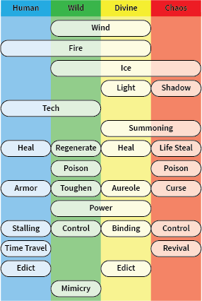

# 要素

[AoW Ideas 計畫](https://github.com/nefarious-kitsune/aow.ideas):
*玩家一些能幫助使遊戲更有趣的修改與改進的想法。*

[English version](elements)

## 技能要素

將攻擊和防禦技能重新分類為佔據特定領域的技能元素。

<table style="border-collapse: collapse; border: 1px solid">
  <thead>
    <tr>
      <th>Type</th>
      <th>Concept</th>
      <th>Sub-Type</th>
      <th>Conceptual Description</th>
    </tr>
  </thead>
  <tbody>
    <tr>
      <td rowspan=9><a href="control">控制</a></td>
      <td rowspan=3>破壞性的</td>
      <td>眩暈</td>
      <td rowspan=3>打斷敵人的行動並產生次要效果。 可以被控制免疫、控制抗性、控制移除和技能觸發無效化</td>
    </tr>
    <tr>
      <td>恐懼/驚嚇</td>
    </tr>
    <tr>
      <td>嘲諷/吸引</td>
    </tr>
    <tr>
      <td rowspan=3>阻礙</td>
      <td>束縛</td>
      <td rowspan=3>阻礙敵人的行動。 可以通過抗凍性來緩解</td>
    </tr>
    <tr>
      <td>沉默</td>
    </tr>
    <tr>
      <td>減速</td>
    </tr>
    <tr>
      <td rowspan=3>變化</td>
      <td>擊退</td>
      <td rowspan=3>對敵方單位造成物理變化。 有次要作用.</td>
    </tr>
    <tr>
      <td>捕捉</td>
    </tr>
    <tr>
      <td>轉換</td>
    </tr>
    <tr>
      <td rowspan=6><a href="natural-elements">自然元素</a></td>
      <td rowspan=2>力量</td>
      <td>火</td>
      <td rowspan=2>強大且對某些控制具有抵抗力</td>
    </tr>
    <tr>
      <td>光</td>
    </tr>
    <tr>
      <td rowspan=2>黑暗</td>
      <td>冰</td>
      <td rowspan=2>創建控制效果</td>
    </tr>
    <tr>
      <td>影</td>
    </tr>
    <tr>
      <td rowspan=2>支持</td>
      <td>風</td>
      <td rowspan=2>增強或減少其他自然元素</td>
    </tr>
    <tr>
      <td>土</td>
    </tr>
    <tr>
      <td rowspan=8>生命</td>
      <td rowspan=3>恢復</td>
      <td>癒合</td>
      <td rowspan=3>恢復友方單位的生命值</td>
    </tr>
    <tr>
      <td>再生</td>
    </tr>
    <tr>
      <td>吸血</td>
    </tr>
    <tr>
      <td rowspan=2>消耗</td>
      <td>收成</td>
      <td rowspan=2>降低敵方單位的生命值</td>
    </tr>
    <tr>
      <td>詛咒</td>
    </tr>
    <tr>
      <td rowspan=3>耐力</td>
      <td>盔甲</td>
      <td rowspan=3>增加（或減少）單位的抵抗力</td>
    </tr>
    <tr>
      <td>增韌</td>
    </tr>
    <tr>
      <td>光環</td>
    </tr>
    <tr>
      <td rowspan=4>法則</td>
      <td rowspan=3>違背法則</td>
      <td>時間旅行</td>
      <td rowspan=3>違反自然法則</td>
    </tr>
    <tr>
      <td>復活</td>
    </tr>
    <tr>
      <td>召喚</td>
    </tr>
    <tr>
      <td>宣示</td>
      <td>詔令</td>
      <td>實行法則</td>
    </tr>
    <tr>
      <td rowspan=2>特殊</td>
      <td>人域與野域</td>
      <td>科技</td>
      <td rowspan=3>專用於特定領域</td>
    </tr>
    <tr>
      <td>野域</td>
      <td>模仿</td>
    </tr>
  </tbody>
</table>

