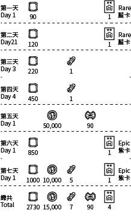

# Inbox

[The AoW Ideas project](https://github.com/nefarious-kitsune/aow.ideas):
*Ideas from AoW players on changes & improvements to help make the game more interesting.*

[中文版](zh.inbox)

## Problem

(1) Collecting rewards take too many steps.

(2) Guild general cannot send members messages

(3) Guild general cannot leave a message when they kick a member

## Suggested Solution

* Reducing redundant screen tapping.
* Use the Inbox as the single user interface for collecting all rewards.
* Use the Inbox to receive messages from guild generals.
* Require guild general to type in a message when they kick a member

Consolidate all rewards
- Delete Daily Quests (and replace with [Exp Quests](../quests/exp-quests))
- Delete the shameful New Releases in Shop page
- Delete the free troops in Mystic page
- Add daily log-in reward
- Deliver the log-in reward to Inbox (expires in 24h after delivery)

### Daily Rewards Examples

### User Interface

2nd Tab in [Command Center](../structure/command-center) interface

