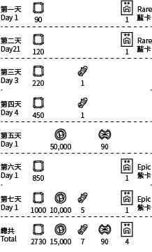

# 收件箱

[AoW Ideas 計畫](https://github.com/nefarious-kitsune/aow.ideas):
*玩家一些能幫助使遊戲更有趣的修改與改進的想法。*

[English](inbox)

## 問題

(1) 收集獎勵的步驟太多。

(2) 公會會長無法向會員發送消息

(3) 公會會長踢成員時不能留言

## 建議的解決方案

* 減少多餘的屏幕點擊。
* 使用收件箱作為收集所有獎勵的單一用戶界面。
* 使用收件箱接收來自公會會長的消息。
* 要求公會會長在踢成員時輸入消息

合併所有獎勵
- 刪除每日任務（並替換為 [經驗值任務](../quests/zh.exp-quests)）
- 刪除商店頁面中，給人三條線的「每日精選」
- 刪除神秘頁面中的免費士兵
- 增加每日登錄獎勵
- 將登錄獎勵發送到收件箱（發送後24小時內到期）

### 每日獎勵示例

### 使用介面

「[指揮中心](../structure/command-center)」界面中的第二個分頁

