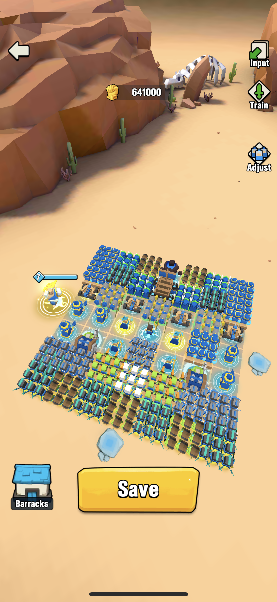
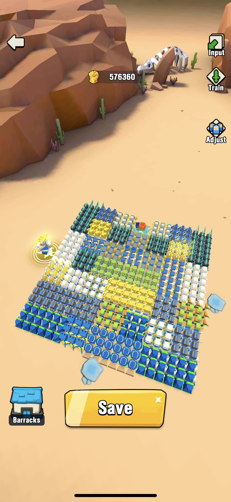
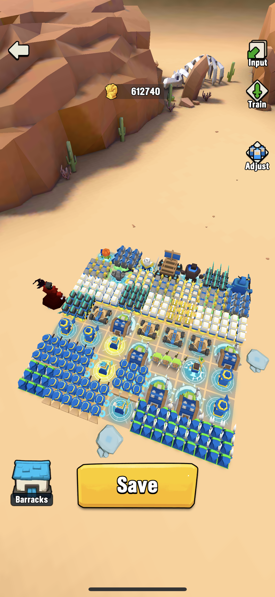

# Complete Guide to Total Noob

by Kitsune

I have played Art of War: Legions for almost two years now.
Currently my arena rank hovers at around 1,000.

I also have several alt accounts in this game, so I have some
experience *being a new player*.

The following is a guide for complete beginners.
Some advices here may be quite subjective.

## 1. Join the community

If I have to name one thing every player must do, then it is
**joining the Discord community**. You can meet many active players
and ask questions about how to best this game. Almost all active
clans have their own Discord servers, so participating in Discord
chat is the best way to find and join good clans.

## 2. Leveling

When you first start the game, you should progress to level 3000 as quickly
as possible so you can unlock most troops and game features. The first
4000 levels are fairly easy and you should be able to pass them quickly with
a random army formation.

Try to hold off on opening Troops Chests until you pass level 3000 (where
Frost Archers are unlocked). You want to maximize your chance of getting this
highly sought-after troops.

## 3. Your first hero

Your friends or clan mates may suggest that you get Selene, Chione, or Aly.
However, I would suggest not to worry about your primary arena hero.

Instead, you should first get **Jinn** to level 6 to 8. After that,
save all your gems and decide on your arena hero later.

In this game, farming gold coins for troops draw is difficult but very
important. You will perform better in arena with many good troops to support
a level 7 hero than you would with few good troops and a level 15 hero.

Jinn and Hohenheim can increase coin drops from defeated enemy units in
main levels. If you
rely on Hero Chests and Super Cards to get Hohenheim, you could be playing for
months and not have Hohenheim at a decent level. Playing Card Master for Jinn
is more reliable way to improve your gold farming quickly.

## 4. Starter Formations

The following are basic formations beginners should work on.

| Arena and Leveling | Honor Hunting | Infinity War |
| ------------------ | ------------- | ------------ |
||)||

## 5. Basic Troops

The following are some of the **value troops** you need to keep:

**Undead Soldier**: basic troops that can revive once. Put them in the
front. If you have spare units, put some in the back.

**Magic Apprentices**: assassin units who can deal AoE damage.
Put them in the front so they can reach enemy's back faster.

**Goblikazes**: self-exploding units that can weaken enemy's front
line. Put them in the first and last rows.

**Ghost Assassins**: assassin units that blink to the
enemy's back. Position them so they can trigger enemy's back-row Goblikazes.

**Ballista**: powerful range units that deal piercing AoE damage.
They have limited shooting ranges, so put them in row 2-3 if possible.

**Ice Mages**: powerful long-range units that deal AoE damage.

**Archers**: fast-attacking long-range units.

The following are some **utility troops** you need to keep:

**Goblin Tech**: engineering troops that construct cannons that
produce AoE damage. They are very useful for Infinity War.

**Bandits**: a Bandits unit throws five daggers (long-range attack) at start
of the battle and then switch to melee (close-range) attack. They have high
attack speed and power, and they can be use as stand-in for almost any troops.

The following are some **filler troops** (placeholders) you need to keep
in the beginning: Fire Mages, Ogre Warrior, Paladin, Harbinger of Fire, and
Cactuses.

## 6. AoE

You may have noticed I used the term AoE a few times. AoE stands for
"Area of Effect". Many troops have attacks that deal damage to multiple
units in an area.

Magic Apprentices, for example, throw magic potion that deal damage in
a circular area. So although Magic Apprentices have low attack power
on paper, they are incredibly effective in battles.

## 7. Acquiring troops

## 8. Honor Hunting

## 9. Temple of Fusion

Most players would suggest that beginners should save gems for hero first
and avoid visiting the Temple of Fusion, and I used to make that advice as well.
However, to be honest, very few people stick to the rule religiously.
With any of my main and alt accounts, I have used Temple of Fusion
before I got the main hero to level 15.

Grinding coin for troops is a long and never-ending process. If you are
mightily struggling and feel fusing troops is the way out, then by all
means visit the Temple of Fusion.

When you fuse troops, make sure the fusion has no negative effect on your
three basic formations.

## 10. Level 9 Troops (Ogre Warrior???)

