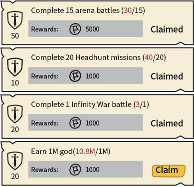

# Exp Quests

[The AoW Ideas project](https://github.com/nefarious-kitsune/aow.ideas):
*Ideas from AoW players on changes & improvements to help make the game more interesting.*

[中文版](zh.exp-quests)

If you agree with this proposal, please vote 👍 [here](https://discord.com/channels/658594298983350293/659077000027308104/932554790855118910)

## Problem

(1) Some quests (e.g. "Kill 5000 legendary enemy units") are time consuming.
Players sometimes get busy in life and could not complete all quests, and
they can feel *stressed* for not being able to collect gem rewards.

(2) Game crash sometimes reset Daily Quest progresses and cause players to miss rewards.

(3) Players typically play the game at multiple times to complete all game modes, and
it is stressful and time-consuming to tap through screens to check for missed game modes.

(4) Some players set daily goals in order to limit their game playing time
(for example: earn 8M gold each day), and the game lacks UI that help players track progress.

## Suggested Solution

Design quests so that they are not compulsory

Remove daily quests (move gem rewards to [log-in rewards](../inbox/inbox))
and replace it with **Exp Quests**.

The new list serves as a *reminder* of things that most players do everyday.
So, players do not need to through screens to check if they miss anything.

Exp Quests should only rewards Exp points and coins so players who cannot
complete them don't feel left behind.

The rewards of Exp Quests and [Achievements](achievements) should follow
the [same rules](exp-point-rules).

| Exp Points | Quest            | Rewards  |
| ---------- | ----------------- | ---------- |
|  10 | Complete 20 Headhunts missions   | 1000 coins |
|  20 | Complete 1 Infinity War battle   | 2000 coins |
|  30 | Complete 3 Honor Hunting battles | 3000 coins |
|  50 | Complete 15 arena battles        | 5000 coins |

Players play each game mode differently. For example, one player may do 1 Infinity War battle each day while another may do 3 Infinity War battles each day. For this reason, the progress should count up even after the quest is completed. (See below)

Consider adding the following quests:

| Exp Points | Quest            | Rewards  |
| ---------- | ---------------- | ---------- |
|  10 | Earn 8M coin            | 1000 coins |
|  10 | Earn 2000 gems          | 2000 coins |

* See [EXP point rules](exp-point-rules)
* See [Achievements](achievements)
* See [Guild quests](guild-quests)
* See [Guild events](guild-events)

### User Interface

3rd Tab in [Command Center](../structure/command-center) interface

