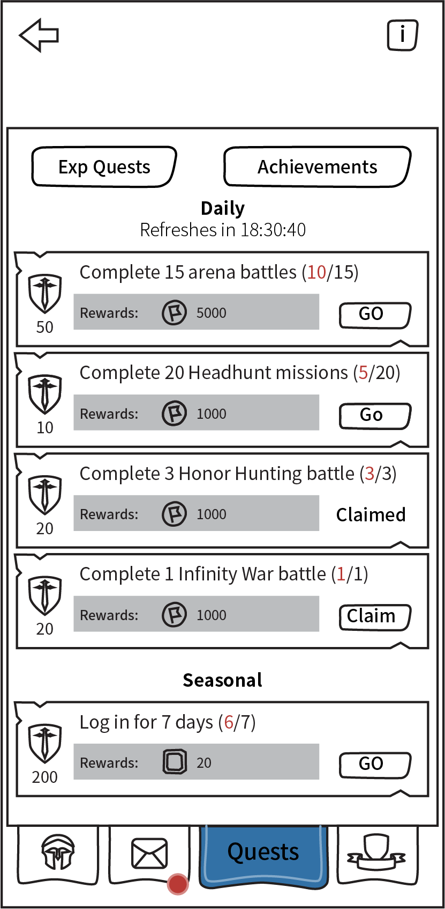

# Exp Quests

[The AoW Ideas project](https://github.com/nefarious-kitsune/aow.ideas):
*Ideas from AoW players on changes & improvements to help make the game more interesting.*

[中文版](zh.exp-quests)

## Problem

Currently, some daily quests such as "Kill 5000 legendary enemy units" are
very time consuming. Players sometimes get busy in life and could not
complete all quests, and they can feel *stressed* for not being able to collect
gem rewards.

Quests should be made so that:
* they are not compulsory
* they can be completed quickly

## Suggested Solution

* Remove daily quests (move gem rewards to [log-in rewards](../rewards/))
* Create new **Exp Quests**
* Exp Quests are essentially a reminder list of things that most players do everyday
* Players do not need to through screens to check if they miss anything
* The Exp Quests only rewards Exp points and coins so players who cannot complete them don't feel left out.
* See [EXP point rules](exp-point-rules)
* See [Achievements](achievements)

### Daily Quests

| Exp Points | Quest            | Rewards  |
| ---------- | ----------------- | ---------- |
|  10 | Complete 20 Headhunts missions   | 1000 coins |
|  20 | Complete 1 Infinity War battle   | 2000 coins |
|  30 | Complete 3 Honor Hunting battles | 3000 coins |
|  50 | Complete 15 arena battles        | 5000 coins |

### Seasonal Quests

Seasonal quests are "tiered" (completing one will unlock the next tier)

| Exp Points | Quest            | Rewards  |
| ---------- | ----------------- | ---------- |
|  100 | Log in for 3 days       | **10 gems**    |
|  200 | Log in for 7 days       | **20 gems**    |
|  400 | Log in for 14 days      | **40 gems**    |

### User Interface

3rd Tab in Command Center interface

