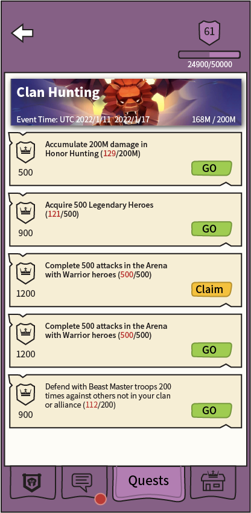
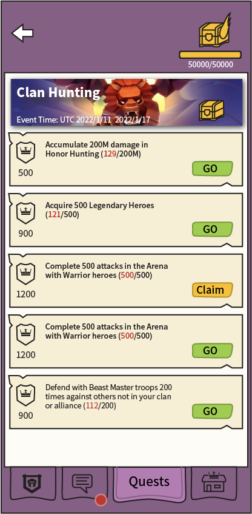

# Guild Events

[The AoW Ideas project](https://github.com/nefarious-kitsune/aow.ideas):
*Ideas from AoW players on changes & improvements to help make the game more interesting.*

[中文版](zh.guild-events)

If you agree with this proposal, please vote 👍 [here](https://discord.com/channels/658594298983350293/659077000027308104/931495467920031764)

## Problem

Too many taps needed to to simple task.

## Suggested Solution

* Unify [Guild Quests](guild-quests) and [Exp Quests](exp-quests) interfaces
* In Guild Quests, move "Guild Level" to upper right corner
* In Exp Quests, move "Exp Level" to upper right corner
* Redesign Exp Level and Guild Level crest graphics so they have consistency
* When a guild reaches a new level, replace the crest graphic with a chest graphic
* Redesign the chest graphic for differentiation (wings)
* When a new event is released, put it in the Exp Quest tab of Command Center (the Headhunts UI is too cluttered)

### User Interface

3rd Tab in Guild interface

| Guild Quests | Guild Quests | Exp Quests   |
| ------------ | ------------ | ------------ |
||||

