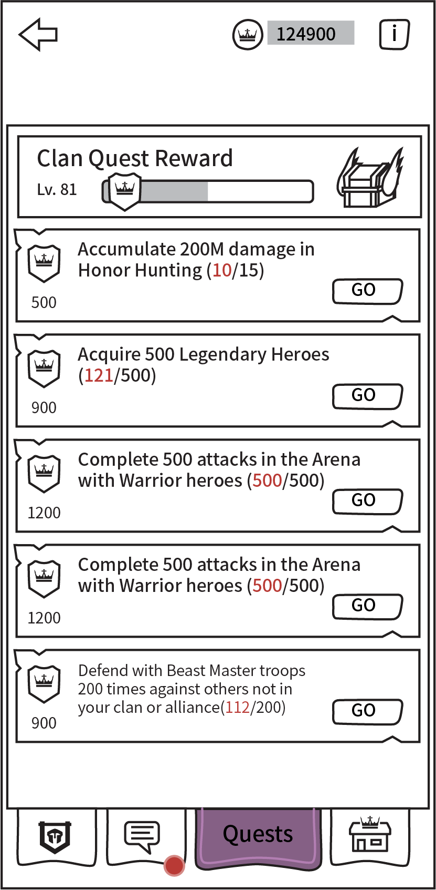

# Guild Quests

[The AoW Ideas project](https://github.com/nefarious-kitsune/aow.ideas):
*Ideas from AoW players on changes & improvements to help make the game more interesting.*

## Problem

(1) Many guilds have problem motivating members to contribute to guild quests.

(2) Many small guilds have difficulty retaining recruits.

(3) Some guild quests are very difficult to fulfill.

## Suggested Solution

* Create a point system to motivate quest contribution.
* When a member contributes to a guild quest, the member earns “silver coins”.
* Members can use silver coins to redeem goodies in the Guild Shop
* When a member leaves a guild, the player loses all silver coins saved (the member needs to spend all silver before leaving).
* Separate guild quests into 3 types:
  * Arena Offense, e.g. Attack in the Arena with Warrior heroes
  * Arena Defense, e.g. Defend in the Arena with Beast Master
  * Non-Arena, e.g. Acquire 500 Legendary Heroes
* The quest list should have two of each type.
* See [EXP point rules](exp-point-rules)
* See [Exp quests](exp-quests)

### Silver Coins

Let’s say the clan quest is “Obtain 240 Epic cards from the Temple of Fusion”
and the total points for completion is 720. Then, when a member obtain one
Epic card, the member earns 720 × 10 ÷ 240 = 30 silver coins.

### User Interface

* 3rd Tab in Guild interface
* New chest design for better differentiation

