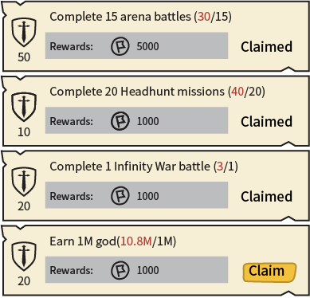

# 經驗值任務

[The AoW Ideas project](https://github.com/nefarious-kitsune/aow.ideas):
*Ideas from AoW players on changes & improvements to help make the game more interesting.*

[English](exp-quests)

如果您同意此提案，請到[這裡](https://discord.com/channels/658594298983350293/659077000027308104/932554790855118910)點擊👍

## 問題

目前，一些每日任務，例如「殺死5000個傳奇敵方單位」。非常耗時。

(1) 有些任務非常耗時，例如「殺死5000個傳奇敵方單位」。
玩家有時會忙於生活而無法完成所有任務，他們會因為無法收集寶石獎勵而感到壓力。

(2) 遊戲有時候會當機並重置任務進度，導致玩家無法完成領取寶石獎勵。

(3) 玩家通常一天分多個時段玩遊戲已完成所有的模式，而確認有哪些模式是未完成的很耗時。

(4) 有些玩家設定每日目標來限制他們的遊戲時間，例如「每日刷8M金幣」，而遊戲沒有介面幫助玩家追蹤進度。

## 建議的解決方案

任務應該設計成非強制性的。

移除每日任務（將寶石獎勵移至[登入獎勵](../inbox/zh.inbox)），並且以「經驗值任務」取代

此新的任務清單可當成大多數玩家每天都會做的事情的提醒清單。
這樣玩家不需要點擊很多畫面來檢查他們是否錯過了任何東西。

「經驗值任務」應該只提供經驗值和金幣的獎勵，這樣無法完成它們的玩家才不會感到落後。

「經驗值任務」與「[成就](zh.achievements)」的獎勵應使用[同樣的規則](zh.exp-point-rules)。

| 經驗值 | 任務           | 獎勵  |
| ---------- | ----------------- | ---------- |
|  10 | 完成 20 賞金任務   | 1000 金幣 |
|  20 | 完成 1 次無限戰爭戰鬥 | 2000 金幣 |
|  30 | 完成 3 次榮耀狩獵戰鬥 | 3000 金幣 |
|  50 | 完成 15 次競技場戰鬥  | 5000 金幣 |

玩家以不同的方式玩每種遊戲模式。 例如，一個玩家每天可能一天打一場無限戰爭，而另一個玩家可能每天打三場無限戰爭。 因此，即使在任務完成後，進度也應該繼續計算。（見下圖）

考慮添加以下任務：

| 經驗值 | 任務        | 獎勵       |
| ---------- | ------ | ---------- |
| 10 | 賺取 8M 金幣   | 1000 金幣   |
| 10 | 賺取 2000 寶石 | 1000 金幣   |

### 使用介面

「[指揮中心](../structure/command-center)」界面中的第三個分頁

