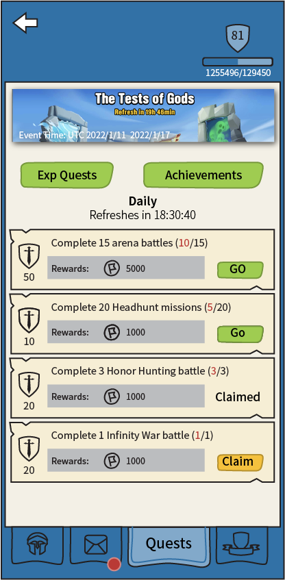

# 經驗值任務

[The AoW Ideas project](https://github.com/nefarious-kitsune/aow.ideas):
*Ideas from AoW players on changes & improvements to help make the game more interesting.*

[English](exp-quests)

## 問題

目前，一些每日任務，例如「殺死5000個傳奇敵方單位」。非常耗時。
玩家有時會忙於生活而無法完成所有任務，他們會因為無法收集寶石獎勵而感到*壓力*。

任務設計上應該是：
* 非強制性的
* 可以快速完成

## 建議的解決方案

* 移除每日任務（將寶石獎勵移至[登入獎勵](../inbox/zh.inbox)）
* 創建新的「經驗值任務」
* 「經驗值任務」基本上是大多數玩家每天都會做的事情的提醒清單
* 玩家不需要點擊很多畫面來檢查他們是否錯過了任何東西
* 「經驗值任務」僅獎勵經驗值和金幣，因此無法完成它們的玩家不會感到落後。
* 參見[經驗值點數規則](zh.exp-point-rules)
* 參見[成就](zh.achievements)

| 經驗值 | 任務           | 獎勵  |
| ---------- | ----------------- | ---------- |
|  10 | 完成 20 賞金任務   | 1000 金幣 |
|  20 | 完成 1 次無限戰爭戰鬥 | 2000 金幣 |
|  30 | 完成 3 次榮耀狩獵戰鬥 | 3000 金幣 |
|  50 | 完成 15 次競技場戰鬥  | 5000 金幣 |

### 使用介面

「[指揮中心](../structure/command-center)」界面中的第三個分頁

