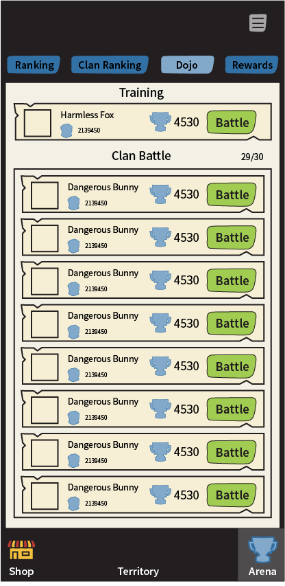
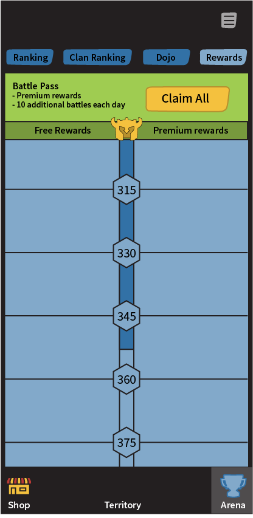

# Arena

[The AoW Ideas project](https://github.com/nefarious-kitsune/aow.ideas):
*Ideas from AoW players on changes & improvements to help make the game more interesting.*

## Problem 

* Players spend a lot of money on a few pixels.
* The Guild interface is getting cluttered.
* "Clan Battles" and "Training" are in different places
* "Clan Battles" require too many taps.

## Suggested Solution

* Give top-ranking whales more pixels (large banners)
* Give top-ranking whale schools more pixels (large banners)
* Move guid ranking to Arena interface
* Create a **Dojo** feature to consolidate Training and Clan Battles
  - Split clan battle quotas for Arena (20/day) and Hero Trial (10/day)
  - Do not display defense hero (should offer experience as close to real arena as possible)

### User Interface

| Rankings | Guild Rankings | Dojo | Rewards    |
| ------- | ------- | -------- |-------------- |
|||||