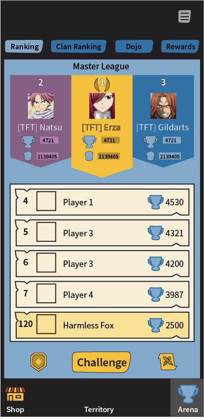

# Inbox

[The AoW Ideas project](https://github.com/nefarious-kitsune/aow.ideas):
*Ideas from AoW players on changes & improvements to help make the game more interesting.*

## Problem 

* Players spend a lot of money on a few pixels.
* "Clan Battles" and "Training" are in different places

## Suggested Solution

* Give the whales more pixels (large banners)
* Give the whale guilds more pixels (large banners)
* Create a **Dojo** feature to consolidate Training and Clan Battles

### User Interface

| Rankings | Guild Rankings | Dojo | Rewards    |
| ------- | ------- | -------- |-------------- |
||| | |