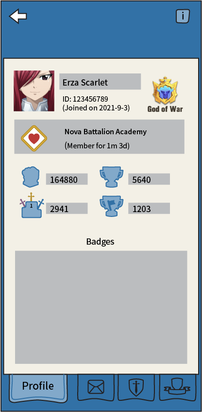

# Command Center

[The AoW Ideas project](https://github.com/nefarious-kitsune/aow.ideas):
*Ideas from AoW players on changes & improvements to help make the game more interesting.*

## Problem

The overall game UI is disorganized.

## Suggested Solution

* Create a unifying gaming experience
* Create Commander Center to consolidate some functions
* A **profile** tab for general information
* An **Inbox** tab for receiving messages *and* rewards
* A **Quests** tab for [EXP Quests](../quests/exp-quests) and [Achievements](../quests/achievements)
* A **Subscription** tab for managing subscriptions
* When entering the UI, the screen defaults to **Quests** tab (not Profile tab)
* Organize the tabs so Commander Center and Guild have consistency.

| Function      | Commander        | Clan      | Alliance  |
| ------------- | ---------------- | ----------| --------- |
| General       | **Profile**      | Profile   | Profile   |
| Communication | **Inbox**        | Chat      | Chat      |
| Quests        | **Quests**       | Quests    | Titan War |
| Resources     | **Subscription** | Clan Shop | Gold Mine |

### User Interface

| Profile | Inbox   | Quests   | Perks  |
| ------- | ------- | -------- |------- |
|| IMAGE   || IMAGE |

