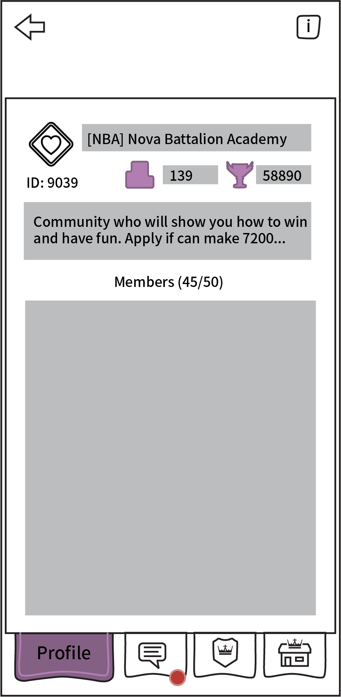
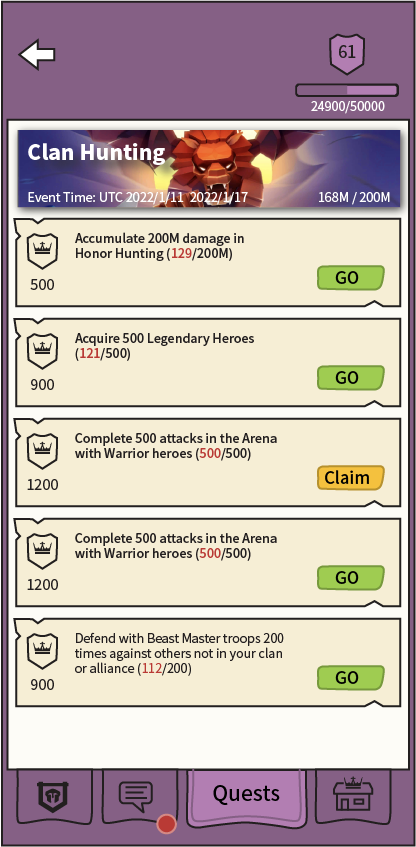
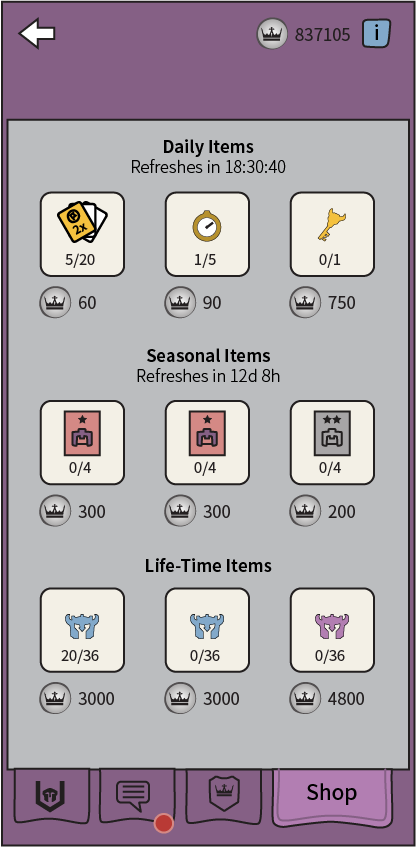

# Guild

[The AoW Ideas project](https://github.com/nefarious-kitsune/aow.ideas):
*Ideas from AoW players on changes & improvements to help make the game more interesting.*

## Problem

The overall game UI is disorganized.

See [Tiers](tiers)

## Suggested Solution

* Redesign Guild interface
* A **Profile** tab for general information
* A **Chat** tab for chatting and receiving announcements
* A **Quests** tab for [Guild Quests](../quests/guild-quests)
* A **Shop** tab for spending silver coins.
* When entering the UI, the screen defaults to **Quests** tab (not Profile tab)
* Organize the tabs so [Command Center](command-center) and Guild have consistency.

| Function      | Commander        | Guild     | Alliance  |
| ------------- | ---------------- | ----------| --------- |
| General       | [Profile](profiles)                | [Profile](profiles)   | Profile   |
| Communication | [Inbox](../inbox/inbox)            | Chat      | Chat      |
| Quests        | [Quests](../quests/exp-quests)     | [Quests](../quests/guild-quests)    | Titan War |
| Resources     | [Exclusive](../shop/subscription)  | [Shop](../shop/guild-shop) | Gold Mine |

### User Interface

| [Profile](profiles) | Chat | [Guild Quests](../quests/guild-quests) | [Shop](../shop/guild-shop) |
| ------- | ------- | -------- |-------------- |
|| |||

