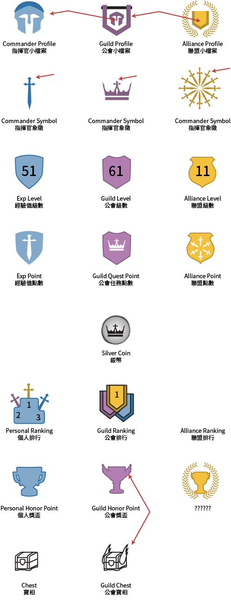

# Tiers

[The AoW Ideas project](https://github.com/nefarious-kitsune/aow.ideas):
*Ideas from AoW players on changes & improvements to help make the game more interesting.*

## Problem

The overall game UI is disorganized.

## Suggested Solution

Create a 3-tier structure, each with its own color scheme

| | [Commander](command-center) | [Guild](guild) | Alliance  |
| ---------| ------------- | ----------| --------- |
| Tier             | 1     | 2         | 3         |
| Primary Color    | Blue  | Purple    | Orange    |
| Secondary Color  | ?     | ?         | ?         |

Organize Command Center, Guild, and Alliance so they
have similar UI.

| Function      | Commander    | Guild     | Alliance  |
| ------------- | ------------ | ----------| --------- |
| General       | [Profile](profiles)                | [Profile](profiles)   | Profile   |
| Communication | [Inbox](../inbox/inbox)            | Chat      | Chat      |
| Quests        | [Quests](../quests/exp-quests)     | [Quests](../quests/guild-quests) | Titan War |
| Resources     | [Exclusive](../shop/subscription)  | [Shop](../shop/guild-shop) | Gold Mine |

## Icon System

