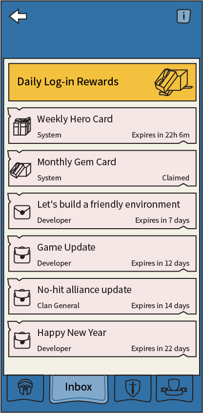

# Suggestions on Farming

Ideas on game improvement from players of Art of War:Legion.

## Gold Earning Tracking

* Let players track how much gold they earn each day.
* Create a new [Exp Quests](quests/exp-quests) such as "Earn 8M coin"
* The progress should count up even after the quest is completed.

[Suggestion by JustTony](https://discord.com/channels/658594298983350293/659077000027308104/933088837629005824)
> [snip] I would like to see a display of 'base gold' left before cap kicks in.
> Would really help know how far the daily farmers are down the line and
> how much they have to go before hiring the drop /cap.
> 
> Perhaps in a battle report under the gold it could display xxx/6000000
> remaining.. I know it couldn't be exact because of the extra bonuses etc,
> but it would be a good indication.

<!--
[Developer's response]()
<blockquote style="color:#b93a35">
</blockquote>
-->

----

## Make it easier to claim daily rewards

[Suggestion by Kitsune](https://discord.com/channels/658594298983350293/659077000027308104/931034062473289830)
> [snip]
> 1. All daily rewards are sent to Inbox
> 2. We can receive messages from Clan General in Inbox
> 3. We can receive a message from Clan General if we are kicked out of a clan

[Suggestion by The Haunter](https://discord.com/channels/658594298983350293/659077000027308104/932187057181294632)
> have all the reward claims on one page instead of running around searching for claims

----

## Make it easier to claim arena rewards

[Suggestion by Kitsune]()
> Make it easy to claim [arena](structure/arena) rewards by reusing the "purchase" button:
> 1. Green "$9.99": No rewards needs claiming. Battle Pass not purchased
> 2. Yellow "claim all": Some rewards needs claiming.
> 3. Disabled "claim all": No rewards needs claiming. Battle Pass already purchased

----

## Make some game activities optional

* Reduce gaming time and give players more control over how they spend the time
* Remove daily quests (move gem rewards to [log-in rewards](inbox/inbox)).
* Create **[Exp Quests](quests/exp-quests)** which serves as a *reminder* of things that most players do everyday.

[Suggestion by 𝓚𝓲𝓽𝓼𝓾𝓷𝓮#0429](https://discord.com/channels/658594298983350293/659077000027308104/932554790855118910)
> [snip]
>
> * Delete Daily Quests
> * Create new Exp Quests that serve as a reminder of things we normally do
> * We can just tap the "Commander Center" icon to if we have done HH, IW, Headhunts, etc.
> 
> [snip]

[Suggestion by Marco Marco](https://discord.com/channels/658594298983350293/659077000027308104/932992098922291241)
> [snip]
> The game should be done in about one hour of the day, and ONLY for
> those who can and wants, another hour, for farming etc.
> 
> Reduce something (leaving the rewards unchanged) so that doing all
> the activities in the game takes less time.
> [snip]

[Suggestion by 𝓚𝓲𝓽𝓼𝓾𝓷𝓮#0429](https://discord.com/channels/658594298983350293/659077000027308104/931017397656223775)
> Thank you for the new game mode, "Tests of Gods".
>
> Game modes should target specific player groups so that
> players can choose what game modes to participate in and
> not forced to play every game modes
>
> Please design the new game mode as a permanent mode to help new players
> farm coins more efficiently.

----